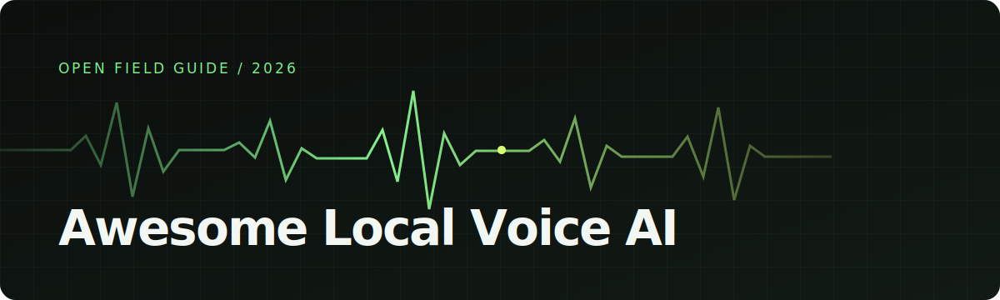

<div align="center">
  
</div>

<p align="center">
  <strong>A source-backed field guide to local text-to-speech, voice cloning, voice design, and voice conversion.</strong>
</p>

<p align="center">
  <a href="https://tarunyadav1.github.io/awesome-local-voice-ai/">Explore the searchable catalog</a> ·
  <a href="CONTRIBUTING.md">Add a project</a> ·
  <a href="docs/METHODOLOGY.md">Read the methodology</a>
</p>

<p align="center">
  <a href="https://github.com/tarunyadav1/awesome-local-voice-ai/actions/workflows/validate.yml"></a>
  <a href="https://github.com/sindresorhus/awesome"></a>
  <a href="LICENSE"></a>
</p>

## Why this exists

Local voice AI is scattered across model cards, research repositories, runtime ports, and app projects. The usual list tells you that a model exists. This one tries to answer the next questions:

- Can I run it on CPU, CUDA, or Apple Silicon?
- Does it synthesize a fixed voice, clone a speaker, design a voice, or convert speech?
- Are the code and model weights under the same license?
- Is commercial use permitted, conditional, or restricted?
- Was the claim read from a source, reproduced locally, or benchmarked?

Use the [interactive catalog](https://tarunyadav1.github.io/awesome-local-voice-ai/) to filter the data. Use this README when you want a version that works anywhere GitHub does.

> [!CAUTION]
> Voice cloning requires the speaker's informed permission. A permissive software license does not grant rights to a person's voice, source recording, trademark, or likeness.

## Quick picks

| Need | Start with | Why |
|---|---|---|
| Small local TTS | [Kokoro-82M](https://huggingface.co/hexgrad/Kokoro-82M), [KittenTTS](https://github.com/KittenML/KittenTTS) | Small checkpoints with CPU, ONNX, MLX, or Core ML paths |
| Voice cloning | [Qwen3-TTS](https://github.com/QwenLM/Qwen3-TTS), [Chatterbox](https://github.com/resemble-ai/chatterbox) | Current projects with cloning support and active ecosystems |
| Apple Silicon | [MLX-Audio](https://github.com/Blaizzy/mlx-audio), [FluidAudio](https://github.com/FluidInference/FluidAudio) | Native-oriented runtimes covering several model families |
| CPU deployment | [Piper](https://github.com/OHF-Voice/piper1-gpl), [Pocket TTS](https://github.com/kyutai-labs/pocket-tts) | Practical local inference without a discrete GPU |
| Voice conversion | [OpenVoice](https://github.com/myshell-ai/OpenVoice), [Seed-VC](https://github.com/Plachtaa/seed-vc) | Tone-color transfer and zero-shot voice conversion |
| Spoken dialogue | [Dia](https://github.com/nari-labs/dia), [Moshi](https://github.com/kyutai-labs/moshi) | Multi-speaker or full-duplex conversational audio work |

These are entry points, not a quality ranking. Hardware, language, latency, and license constraints can change the right choice.

<!-- CATALOG:START -->

## Model catalog

Last source review: **2026-07-17**. Every row links to its project and license evidence.

| Project | What it does | Languages | Size | Local targets | Clone | Commercial | License |
|---|---|---|---|---|---:|---:|---|
| **[Chatterbox](https://github.com/resemble-ai/chatterbox)**<br><sub>Resemble AI</sub> | A family of expressive TTS models with zero-shot cloning, multilingual speech, and paralinguistic reaction tags. | 23 in multilingual model | 350M / 500M | CUDA, MPS, MLX | Yes | Yes | [MIT](https://github.com/resemble-ai/chatterbox/blob/master/LICENSE) |
| **[CosyVoice](https://github.com/FunAudioLLM/CosyVoice)**<br><sub>FunAudioLLM</sub> | A multilingual TTS stack with zero-shot and cross-lingual cloning, instruction control, training, and deployment tooling. | Multilingual; version-dependent | 0.5B class | CUDA, MLX | Yes | Yes | [Apache-2.0](https://github.com/FunAudioLLM/CosyVoice/blob/main/LICENSE) |
| **[CSM](https://github.com/SesameAILabs/csm)**<br><sub>Sesame AI Labs</sub> | A conversational speech-generation model conditioned on text and prior audio context for natural multi-turn delivery. | English-focused | 1B | CUDA, MPS, MLX | Limited | Conditional | Code: [Apache-2.0](https://github.com/SesameAILabs/csm/blob/main/LICENSE)<br>Weights: [Apache-2.0 plus Llama dependency](https://huggingface.co/sesame/csm-1b) |
| **[Dia](https://github.com/nari-labs/dia)**<br><sub>Nari Labs</sub> | A dialogue-first English TTS model with two-speaker scripts, nonverbal tags, audio prompting, and voice cloning. | English | 1.6B | CUDA, MLX | Yes | Yes | [Apache-2.0](https://github.com/nari-labs/dia/blob/main/LICENSE) |
| **[F5-TTS](https://github.com/SWivid/F5-TTS)**<br><sub>SWivid</sub> | A flow-matching TTS system used for zero-shot voice cloning and research on natural speech generation. | English and Chinese releases | 335M | CUDA, MLX | Yes | No | Code: [MIT](https://github.com/SWivid/F5-TTS/blob/main/LICENSE)<br>Weights: [CC-BY-NC-4.0](https://huggingface.co/SWivid/F5-TTS) |
| **[Fish Speech](https://github.com/fishaudio/fish-speech)**<br><sub>Fish Audio</sub> | An expressive multilingual speech model family with cloning and fine-grained delivery controls. | Multilingual; version-dependent | 0.5B to 5B | CUDA, MLX | Yes | No | Code: [Fish Audio Research License](https://github.com/fishaudio/fish-speech/blob/main/LICENSE)<br>Weights: [Model-specific research terms](https://huggingface.co/fishaudio) |
| **[KittenTTS](https://github.com/KittenML/KittenTTS)**<br><sub>KittenML</sub> | An ultra-small CPU and ONNX TTS family designed for low-memory and edge deployments. | English-focused releases | 15M to 80M | CPU, ONNX | No | Yes | [Apache-2.0](https://github.com/KittenML/KittenTTS/blob/main/LICENSE) |
| **[Kokoro-82M](https://huggingface.co/hexgrad/Kokoro-82M)**<br><sub>hexgrad</sub> | A small fixed-voice model with fast local inference, a broad runtime community, and no native voice cloning. | 8 language codes in v1.0 | 82M | CPU, MLX, Core ML, ONNX | No | Yes | [Apache-2.0](https://huggingface.co/hexgrad/Kokoro-82M) |
| **[LFM2.5-Audio](https://github.com/Liquid4All/liquid-audio)**<br><sub>Liquid AI</sub> | A 1.5B end-to-end speech model for text, audio input, TTS, ASR, and low-latency speech-to-speech interaction. | Multilingual; version-dependent | 1.5B | CPU, CUDA, ROCm | No | Conditional | [LFM Open License v1.0](https://github.com/Liquid4All/liquid-audio/blob/main/LICENSE) |
| **[MeloTTS](https://github.com/myshell-ai/MeloTTS)**<br><sub>MyShell</sub> | A multilingual fixed-speaker TTS library that can run in real time on CPU. | English, Spanish, French, Chinese, Japanese, Korean | Varies | CPU, CUDA | No | Conditional | [MIT](https://github.com/myshell-ai/MeloTTS/blob/main/LICENSE) |
| **[Moshi](https://github.com/kyutai-labs/moshi)**<br><sub>Kyutai</sub> | A full-duplex speech-text model and streaming dialogue framework with an official MLX implementation. | Model-dependent | 7B class | CUDA, MLX | Limited | Yes | Code: [MIT / Apache-2.0](https://github.com/kyutai-labs/moshi)<br>Weights: [CC-BY-4.0](https://huggingface.co/kyutai/moshiko-pytorch-bf16) |
| **[OmniVoice](https://github.com/k2-fsa/OmniVoice)**<br><sub>k2-fsa</sub> | A compact multilingual TTS system focused on zero-shot cloning, voice design, and broad language coverage. | 600+ reported | 0.6B | CUDA, MPS | Yes | Yes | [Apache-2.0](https://github.com/k2-fsa/OmniVoice/blob/main/LICENSE) |
| **[OpenVoice](https://github.com/myshell-ai/OpenVoice)**<br><sub>MyShell</sub> | An established system for instant cross-lingual voice cloning and tone-color transfer from short references. | Cross-lingual; base-model dependent | Varies | CUDA, CPU | Yes | Conditional | [MIT](https://github.com/myshell-ai/OpenVoice/blob/main/LICENSE) |
| **[Orpheus TTS](https://github.com/canopyai/Orpheus-TTS)**<br><sub>Canopy Labs</sub> | A Llama-based expressive TTS family with streaming generation, voice cloning, and emotion tags. | English plus research previews | 3B | CUDA | Yes | Yes | [Apache-2.0](https://github.com/canopyai/Orpheus-TTS/blob/main/LICENSE) |
| **[Parler-TTS](https://github.com/huggingface/parler-tts)**<br><sub>Hugging Face</sub> | A text-described voice model with public training data, training code, and permissively released checkpoints. | Checkpoint-dependent | 880M | CUDA, MPS | No | Yes | [Apache-2.0](https://github.com/huggingface/parler-tts/blob/main/LICENSE) |
| **[Piper](https://github.com/OHF-Voice/piper1-gpl)**<br><sub>Open Home Foundation</sub> | A fast local neural TTS engine with a large voice collection and practical CPU deployment. | Voice-dependent | Voice-dependent | CPU, ONNX | No | Conditional | Code: [GPL-3.0](https://github.com/OHF-Voice/piper1-gpl/blob/main/COPYING)<br>Weights: [Varies by voice](https://github.com/OHF-Voice/piper1-gpl/blob/main/docs/VOICES.md) |
| **[Pocket TTS](https://github.com/kyutai-labs/pocket-tts)**<br><sub>Kyutai</sub> | A lightweight CPU-first TTS package with preset voices and zero-shot voice cloning from short reference audio. | English | 100M class | CPU | Yes | Yes | Code: [MIT](https://github.com/kyutai-labs/pocket-tts/blob/main/LICENSE)<br>Weights: [CC-BY-4.0](https://huggingface.co/kyutai/pocket-tts) |
| **[Qwen3-TTS](https://github.com/QwenLM/Qwen3-TTS)**<br><sub>Qwen</sub> | A 0.6B and 1.7B model family for preset voices, three-second cloning, voice design, instruction control, and ten languages. | 10 major languages | 0.6B / 1.7B | CUDA, MLX | Yes | Yes | [Apache-2.0](https://github.com/QwenLM/Qwen3-TTS/blob/main/LICENSE) |
| **[RVC WebUI](https://github.com/RVC-Project/Retrieval-based-Voice-Conversion-WebUI)**<br><sub>RVC Project</sub> | A widely used retrieval-based voice-conversion training and inference interface with a large community model ecosystem. | Language-agnostic conversion | Model-dependent | CUDA, MPS, CPU | Not Applicable | Varies | Code: [MIT](https://github.com/RVC-Project/Retrieval-based-Voice-Conversion-WebUI/blob/master/LICENSE)<br>Weights: [Varies by trained model](https://github.com/RVC-Project/Retrieval-based-Voice-Conversion-WebUI) |
| **[Seed-VC](https://github.com/Plachtaa/seed-vc)**<br><sub>Plachtaa</sub> | A zero-shot speech and singing voice-conversion system with offline and real-time modes. | Cross-lingual conversion | Version-dependent | CUDA, MPS | Not Applicable | Conditional | Code: [GPL-3.0](https://github.com/Plachtaa/seed-vc/blob/main/LICENSE)<br>Weights: [Model-specific](https://huggingface.co/Plachta/Seed-VC) |
| **[Spark-TTS](https://github.com/SparkAudio/Spark-TTS)**<br><sub>SparkAudio</sub> | A controllable English and Chinese model with zero-shot cloning plus pitch, gender, and speaking-rate controls. | English and Chinese | 0.5B | CUDA, MLX | Yes | Yes | [Apache-2.0](https://github.com/SparkAudio/Spark-TTS/blob/main/LICENSE) |
| **[VCClient](https://github.com/w-okada/voice-changer)**<br><sub>w-okada</sub> | A real-time voice-conversion desktop client with Apple Silicon builds and support for multiple conversion engines. | Language-agnostic conversion | Engine-dependent | CUDA, CPU, MPS | Not Applicable | Varies | Code: [Custom terms](https://github.com/w-okada/voice-changer/blob/master/LICENSE)<br>Weights: [Varies by engine and model](https://github.com/w-okada/voice-changer) |
| **[VibeVoice](https://github.com/microsoft/VibeVoice)**<br><sub>Microsoft</sub> | A long-form multi-speaker voice model family for podcasts, dialogue, expressive speech, and speech recognition. | English and Chinese releases | 0.5B to 7B | CUDA | Limited | Varies | Code: [MIT](https://github.com/microsoft/VibeVoice/blob/main/LICENSE)<br>Weights: [Model-specific](https://huggingface.co/microsoft/VibeVoice) |

## Local runtimes

| Project | Purpose | Platforms | License |
|---|---|---|---|
| **[FluidAudio](https://github.com/FluidInference/FluidAudio)** | A Swift and Core ML audio package for on-device TTS, transcription, VAD, and diarization on Apple hardware. | iOS, macOS, Core ML, Swift | [Apache-2.0](https://github.com/FluidInference/FluidAudio/blob/main/LICENSE) |
| **[MLX-Audio](https://github.com/Blaizzy/mlx-audio)** | An Apple Silicon library and server for running many TTS, speech-to-text, and speech-to-speech models through MLX. | macOS, iOS, MLX | [MIT](https://github.com/Blaizzy/mlx-audio/blob/main/LICENSE) |
| **[sherpa-onnx](https://github.com/k2-fsa/sherpa-onnx)** | A cross-platform ONNX speech runtime with mobile examples and support for several offline TTS model families. | iOS, macOS, Android, Windows, Linux, ONNX | [Apache-2.0](https://github.com/k2-fsa/sherpa-onnx/blob/master/LICENSE) |

## Local apps

Commercial and open-source apps may be listed if their local processing claim can be checked. Affiliation is always disclosed.

| App | Purpose | Platforms | Price | Source | Disclosure |
|---|---|---|---|---|---|
| **[Murmur](https://www.murmurtts.com/?utm_source=github&utm_medium=referral&utm_campaign=awesome_local_voice_ai&utm_content=apps_table)** | A paid local voice studio for Apple Silicon with cloning, voice design, multi-speaker projects, and export. | macOS, Apple Silicon | $49 one-time | Proprietary | Maintainer-affiliated |
| **[OmniVoice Studio](https://github.com/debpalash/OmniVoice-Studio)** | A local desktop interface for OmniVoice cloning, voice design, dubbing, and dictation. | Windows, Linux, macOS | Free | [See repository](https://github.com/debpalash/OmniVoice-Studio) | Independent |
| **[Voicebox](https://voicebox.sh/)** | An open-source local voice studio for cloning, speech generation, dictation, and agent integrations. | Windows, Linux, macOS | Free | [Open source; see repository](https://github.com/jamiepine/voicebox) | Independent |

<!-- CATALOG:END -->

## What the labels mean

- **Source reviewed:** a maintainer checked the linked first-party project, model card, and license material.
- **Runtime reproduced:** a maintainer ran the model locally and recorded the environment and result.
- **Benchmark reproduced:** a maintainer ran the published protocol and retained the output.
- **Apple upstream:** the original project documents Apple support.
- **Apple verified runtime:** a maintained runtime lists an implementation for that model family.
- **Apple community port:** a separate community project provides the implementation.

See [Methodology](docs/METHODOLOGY.md), [Apple support](docs/APPLE-SUPPORT.md), and [License notes](docs/LICENSES.md) before relying on a label for production work.

## Contributing

Corrections are as valuable as new entries. Submit the [model request form](https://github.com/tarunyadav1/awesome-local-voice-ai/issues/new?template=model.yml) or edit `data/catalog.json` and open a pull request. Every factual claim needs a first-party source.

Generated files are checked in CI:

```bash
npm run generate
npm run check
```

Read [CONTRIBUTING.md](CONTRIBUTING.md) for the acceptance rules and review checklist.

## Scope

Included:

- Projects that can run inference on hardware controlled by the user
- TTS, voice cloning, voice design, voice conversion, and spoken dialogue models
- Local runtimes and end-user apps with checkable processing claims

Not included:

- Cloud-only APIs
- Model announcements without downloadable inference artifacts
- Unverified mirrors that obscure the original license or source
- Generic audio generation projects with no speech or voice task

Music generation is a large enough field to deserve its own catalog. This repository keeps the boundary at voice and speech so the comparison stays useful.

## Disclosure

The maintainer builds [Murmur](https://www.murmurtts.com/?utm_source=github&utm_medium=referral&utm_campaign=awesome_local_voice_ai&utm_content=readme_disclosure), a local macOS TTS app listed in the apps table. It receives no ranking advantage. The catalog is alphabetized, its affiliation is marked, and competing apps are welcome under the same criteria.

## License

The catalog data, documentation, and original site code are released under [CC0-1.0](LICENSE). Each linked project keeps its own code, model, dataset, voice, and media licenses.
